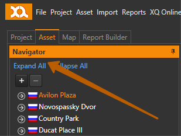
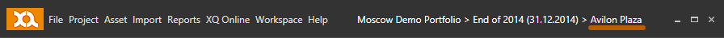
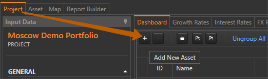
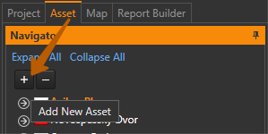
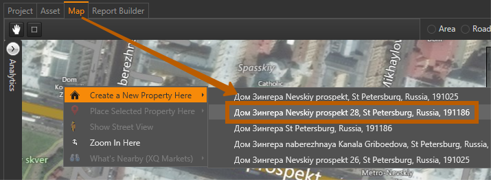

---
---
[XQ Helpdesk](http://help.exquance.com) > [How To](http://help.exquance.com/howto/) > Edit assets

## How to edit assets ##

When you created a new analysis, or opened an existing analysis, you can browse the assets it contains by using the **Navigator** window under the **Asset** tab.

To begin working with a particular asset from the list, you need to single-click on its name in the **Navigator**, the application window title will reflect the current selected object:

### Creating a new asset
Apart from the [automated importing of assets](../howto/import-data.html#assets) from an external Excel file, you may wish to add new assets manually to your analysis. There are two ways in the application to quickly create a new asset:

* Open an empty asset dialogue
* Open a pre-filled asset dialogue

If you wish to create a new asset and manually define its location, you can call the **Create new asset** dialogue from the **Project** > **Dashboard** tab by pressing  :

Or press  in the **Navigator** window under the **Asset** tab:

If you wish to search for the asset's address first, you can navigate to its location on the map and right-click to see the options in the appeared context menu:

If the location is recognized by the map engine, you will be given a choice of addresses, and in some cases the asset's names. Select the one that suits your asset and the new asset dialogue window will appear, containing the the asset's name, geolocation, and address.
