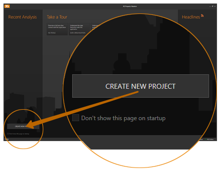
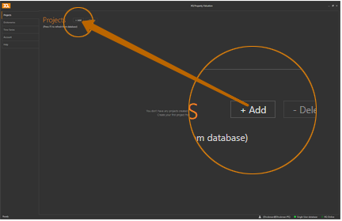
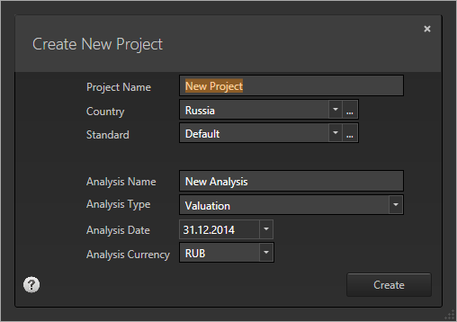

---
---

----------
## How to start a valuation ##

To start a new valuation, you can create a new [project](../getstarted/data.html#project-analysis), or add a new [analysis](../getstarted/data.html#project-analysis) to an existing project.

### Starting a new project ###
When the application opens, you can press the `Create new project` button on the start screen:

Alternatively, when you're in the home menu (you can open it at any time by pressing the **Home Menu button**  in the top left corner of the application window), you can create a new project by clicking the `+ Add` button in the **Projects** section:

When the **Create new project** dialogue appears, enter the name for your new project and all the other required fields:

`Country` - set the country where your project's assets are located.
>*If you have a multi-country project, you can add other countries later.*

`Standard` - once you select a country, a default country's standard will be chosen from the [Countries dictionary](../howto/use-dictionaries.html#countries). The standard defines which collection of [Cash Flow Templates](../howto/use-dictionaries.html#cftemplates) will be used for your project.

`Analysis type` - this determines whether the financial model you're about to create will contain only forecasted cash flows and asset-related input (Valuation), or it will have historic cash flows and legal structure with company-related input (Investment Analysis).
>*The 'Investment analysis' type is only accessible in [XQ Property Investment Management](../getstarted/tools.html#xqdesktop).*

`Analysis date` - all the assumptions you make under this analysis will be valid as of this date, so as the cash flows will be forecasted from that date forward.

`Analysis currency` - the currency you select will be automatically set as default [input currency](../getstarted/data.html#currency) and [valuation display currency](../getstarted/data.html#currency).
>*The currency will be automatically selected based on the country you chose, however if you set a different currency here, the country's default currency will be nonetheless added to the project and you can use it as input currency, but you will need to provide FX rates forecast for conversion.*

----------

When you press the `Create` button, your new analysis within the new project will be created and automatically open for further editing.
>*If you wish to immediately share the newly created project with your colleagues, press the **Home Menu button**  and navigate to **Members** section for the project to [add new project members](../howto/edit-project-members.html#addnew).*
